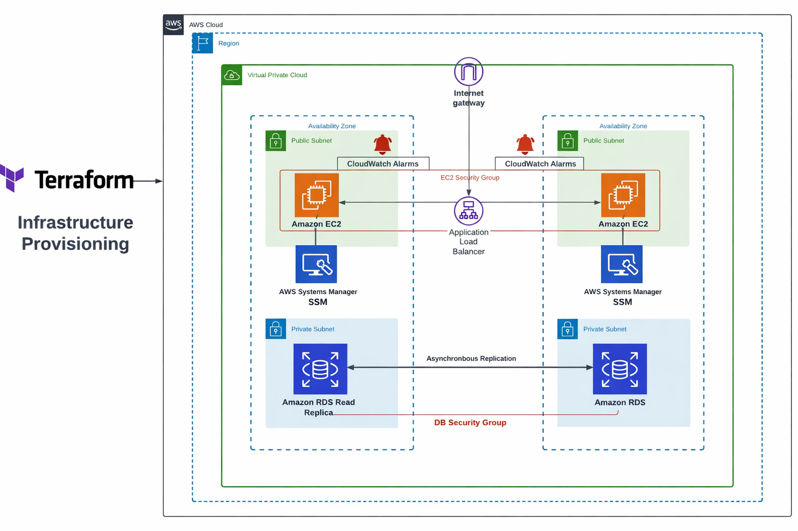
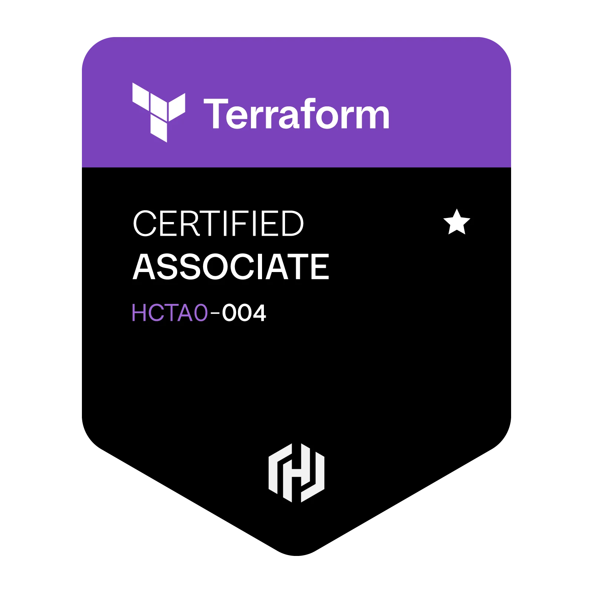
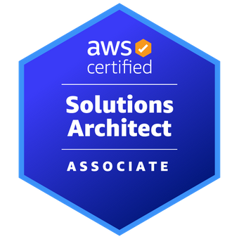

# aws-ha-infrastructure-terraform
Proyecto de infraestructura de Alta-Disponibilidad, con ALB, ASG EC2, SSM y RDS
=======
# AWS Production Infrastructure with Terraform

Infraestructura cloud desplegada con Terraform utilizando arquitectura escalable.

## Arquitectura

- VPC multi-AZ
- Application Load Balancer
- Auto Scaling Group
- RDS MySQL
- SSM Session Manager
- CloudWatch monitoring

## Diagrama

## Tecnologías

- Terraform
- AWS
- EC2
- ALB
- RDS
- CloudWatch
- SSM

## Despliegue

terraform init
terraform plan
terraform apply

## Resultados

- ALB balancea tráfico entre instancias
- ASG escala automáticamente
- Acceso a instancias mediante SSM
- Monitorización con CloudWatch

## Objetivo del proyecto

Este proyecto consiste en el despliegue de una infraestructura de alta disponibilidad en AWS mediante Infrastructure as Code (IaC) con Terraform.

La solución incluye una VPC con subredes públicas y privadas, un Application Load Balancer, un Auto Scaling Group con instancias EC2, acceso mediante AWS Systems Manager, monitorización básica y una base de datos RDS desplegada en subredes privadas.

He desarrollado este proyecto con el objetivo de poner en práctica conceptos clave de Terraform, como el uso de módulos, variables, outputs, dependencias y organización del código, mientras me preparo para la certificación HashiCorp Terraform Associate 004.

Al mismo tiempo, este laboratorio me ha servido para reforzar conocimientos de AWS y aplicar de forma práctica conceptos alineados con la certificación AWS Solutions Architect Associate.

## Certificaciones

  
  

## Coste estimado

Compatible con AWS Free Tier.

## Validation Tests
Pruebas end-to-end realizadas post-`terraform apply`.

**Documentación completa**: [Pruebas de Validación](docs/pruebas-validacion.pdf)

- ✅ ALB Round-Robin
- ✅ SSM Session Manager
- ✅ ASG Auto-Scaling
- ✅ RDS Connectivity

## Autor

Joel Gonzalez

>>>>>>> de3897c (Initial commit - AWS production infrastructure with Terraform)
